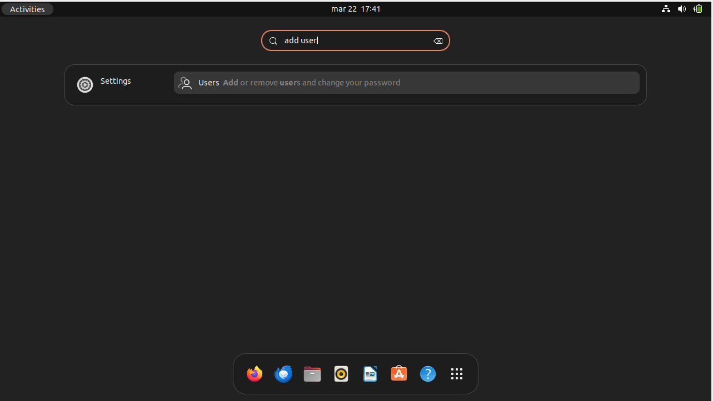
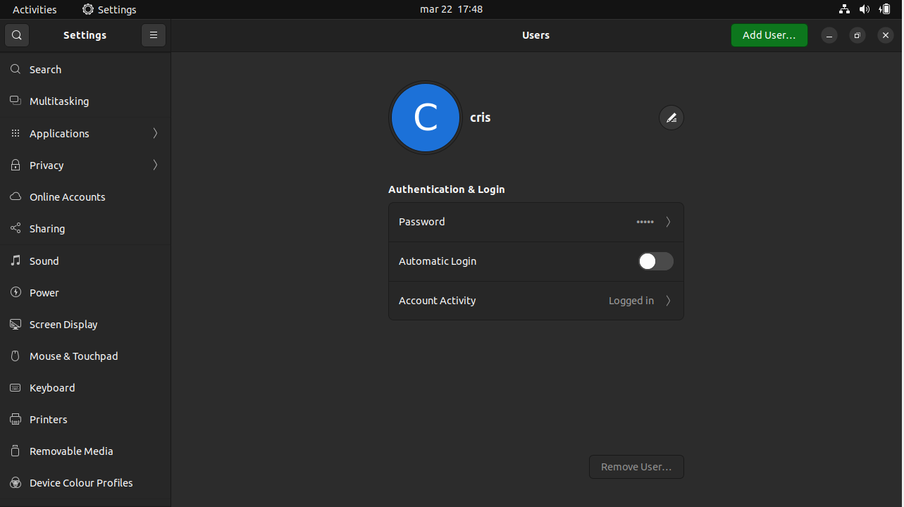
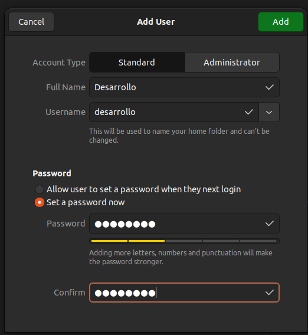
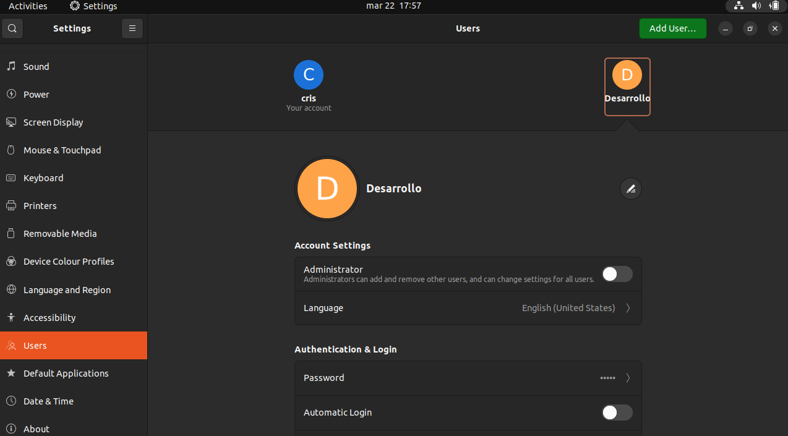
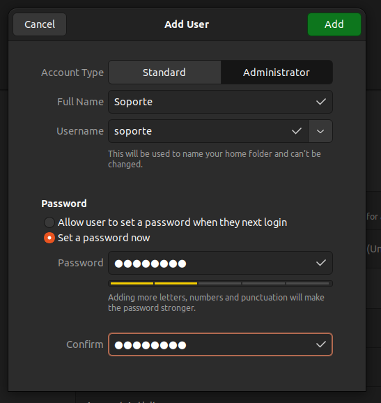
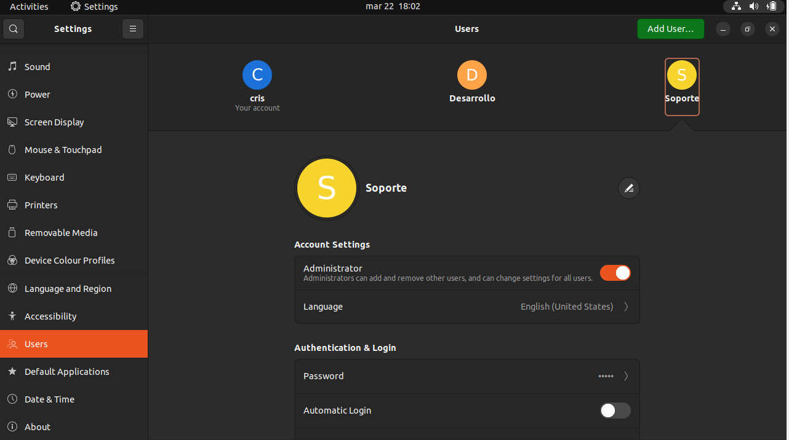

# 1. Creación de un usuario estándar

Buscar "add user" o el equivalente en su lenguaje.



Es posible que la configuración le pida permisos de superusuario en los
siguientes pasos. Concédalos, debería ver la ventana de configuración de
la siguiente forma:



> Si su cuenta no tiene privilegios de administrador, vea al final de
> este documento como concedérselos.

Haga click en "add user" y configure su usario de forma similar a la
siguiente:



Finalmente, debería su configuración de la siguiente manera:



# 2. Creación de un usuario administrador

Repita los pasos del primer apartado, pero esta vez marcando al usuario
como administrador al crearlo:



Una vez hecho esto, debería poder ver lo siguiente:



# 3. Creación de un grupo de usuarios

Ejecutar los siguientes comandos, que instalarán las interfaces
necesarias:

``` bash
sudo apt-get update
sudo apt-get install gnome-system-tools
```

Abrir la aplicación *Users and Groups* recientemente instalada.

Hacer click en `Manage Groups -> Add`, e ingresar esta configuración (la
id del grupo es irrelevante, dejarla por defecto):


> No se puede utilizar "Desarrollo" como nombre ya que no se admiten
> grupos con nombres en mayúscula. Tampoco se puede usar "desarrollo"
> como nombre ya que ese grupo se creo automáticamente con la creación
> del usuario "desarrollo" y se le asignó. Para este trabajo utilizo el
> nombre "dessarrollo2".

Para asignarle este grupo al usuario desarrollo, vuelva a la pantalla
principal del programa *Users and Groups*, seleccione el usuario e
ingrese a `Advances settings -> Advanced` y cambie el grupo principal al
creado:


# Como concederse privilegios de administrador

Abra la terminal, ejecute `su -` para iniciar sesión como root, y
ejecute:

``` bash
usermod -a -G sudo usuario # Cambie usuario por el nombre del usuario deseado.
```

Para terminar su sesión de root, ejecute `exit`.

# Bibliografía

[Como manejar
usuarios](https://askubuntu.com/questions/66718/how-to-manage-users-and-groups-using-gui)

[Concederse privilegios de
administrador](https://askubuntu.com/questions/339484/how-to-assign-administratives-rights-privileges-to-a-user)
